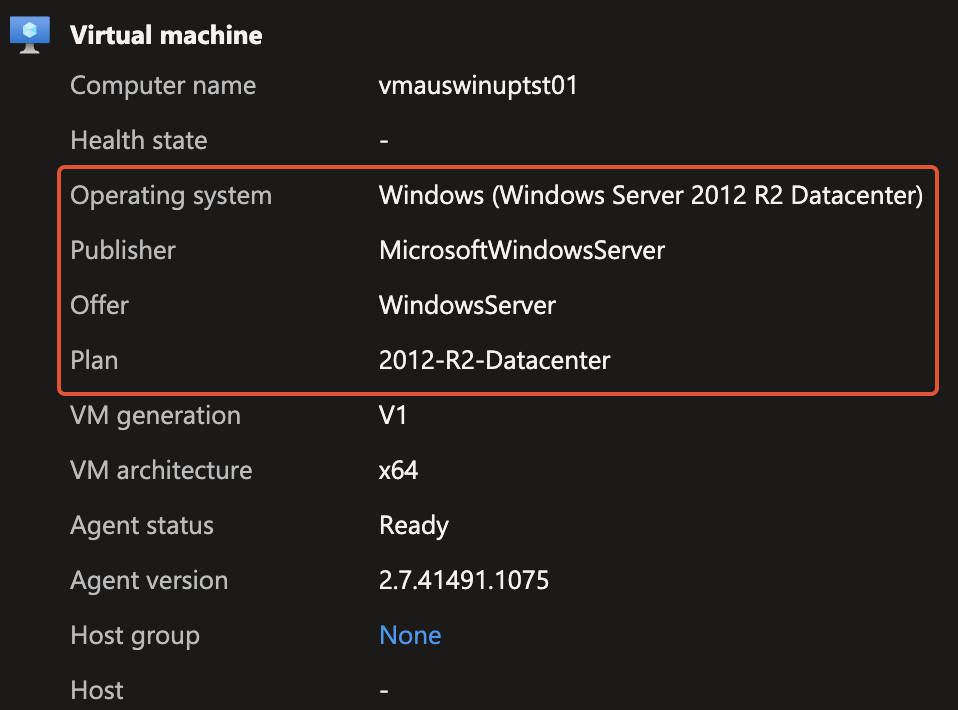
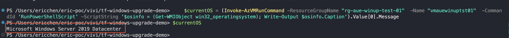
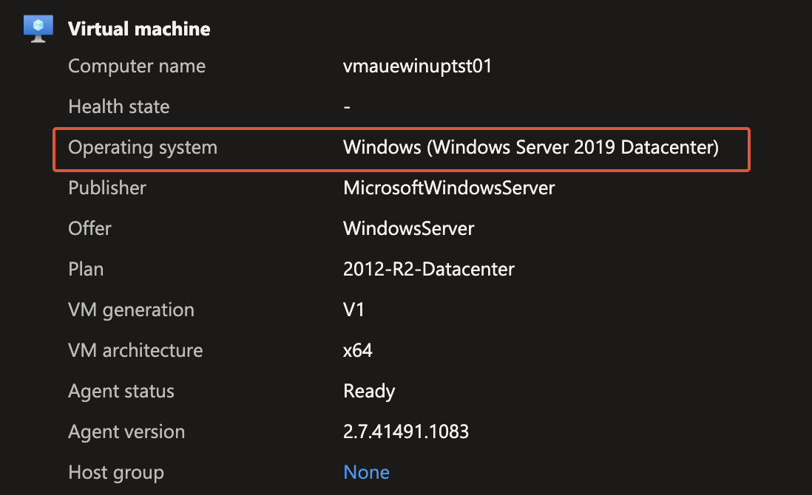

# Upgrade in place: windows server 2012 -> 2019 Demo

This is a POC project to upgrade a Windows Server 2012 to a Windows Server 2019. The tested script then can be applied to a fleet of VMs to perform batch OS upgrade.

## Demo results

1. Initial windows server 2012 R2 build.
   

2. Upgrade windows server 2012 to windows server 2019.
   
   
